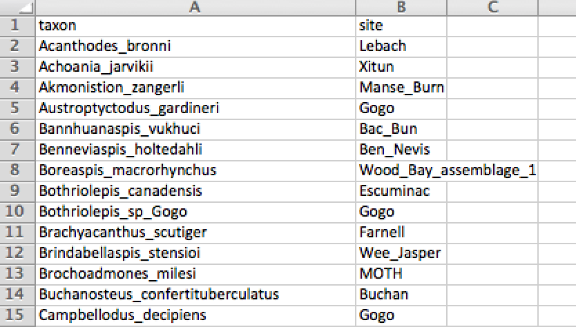
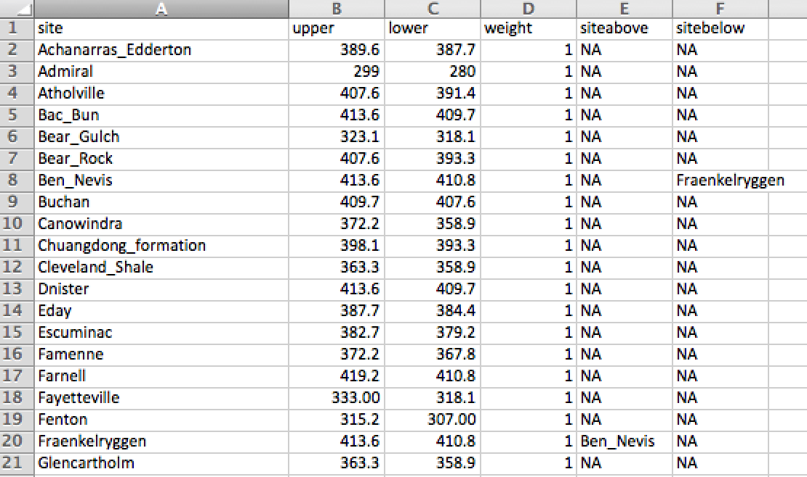
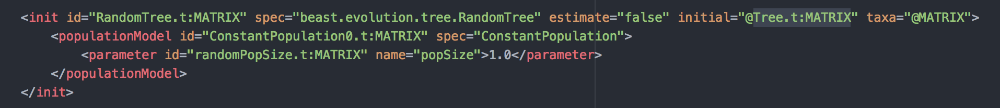
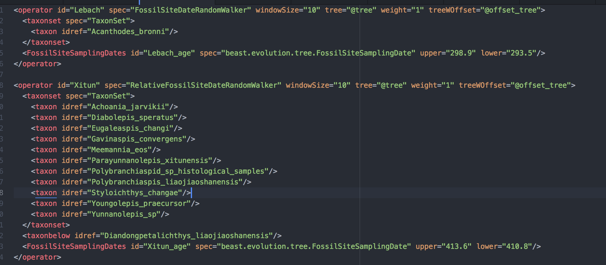
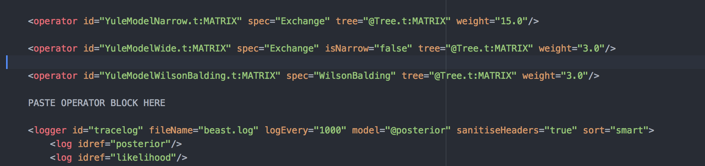

Preparing the tip date input files
----------------------------------
The input requires two tables: one in which each fossil is assigned to a site, and a second in which the age of each site is given.
In the first table, there should be one column called **taxon**, and another called **site**. Use simple site names without spaces.


In the second table, the first column is for the **site** and needs to match the spelling in the first table. The second and third columns are for the **upper** and **lower**  age bounds. The fourth column is for the operator **weight** for each site. This is the relative amount of time the analysis will attempt to update the age value for that site. In general a weight of 1 or less will suffice for every site, but in certain circumstances (e.g. a site with a lot of taxa) it might be beneficial to increase the weight. 

The last two columns are for the RelativeFossilSiteDateRandomWalker class only (both columns should otherwise have *NA* in which case a standard FossilSiteDateRandomWalker will be created). In this example, the Fraenkelryggen and Ben Nevis formations are given the same upper and lower bounds, but the Ben Nevis formation is constrained to always have a younger date. The **siteabove** and **sitebelow** inputs are used for this. Note that above and below is in terms of stratigraphy i.e. the Fraenkelryggen formation is older than the Ben Nevis formation, so is placed in the sitebelow column for the Ben Nevis formation. These siteabove and sitebelow inputs should always come in reciprocal pairs. It is possible to have more than two sites in a sequence, in which case sites in the middle should have both a siteabove and a sitebelow input.


After the tables have been made, they should be saved as tab-delimited text files.

Generating the xml code
-----------------------
Now we will use R to generate the xml code for the operators on the age of each fossil site. You will need to install the R package **XML**. First, set a working directory that contains the two tables with the taxon and site information, and the **operators.xml.R** file which can be found [here](https://github.com/king-ben/palaeo/tree/master/R_xml_tools). Then you need to enter a few commands. In the example, the code is as follows:
```
library(XML)
source("operators.xml.R")
operators.xml(taxonfile="taxa.txt", sitesfile="sites.txt", outputfile="operators.xml", treeid="tree", offset=T, offsetid="offset_tree")
```
The options for this function are:
* `taxonfile` : The name of the table with site assignments for each taxon. "taxa.txt" in this example.
* `sitesfile` : The name of the table with infomation for each site. "sites.txt" in this example.
* `outputfile` : A name for the output file containing the xml code for the site age operators.
* `treeid` : The xml id for the tree. See below for more information.
* `offset` : A TRUE/FALSE input, TRUE if the TreeWOffset class from sampled ancestors is used (i.e. the youngest taxa have sampled dates). If you don't know what this is, then set it to FALSE (the default).
* `offsetid` : The xml id for the offset tree, if offset=True.

Inputting the correct name to treeid requires you to know the id for the tree in your xml file. This can be found in BEAUti, or in your xml file, often in the initialisation block. You can look for an xml block in your analysis similar to this one. If you use BEAUti, then you tree id might be something like *Tree.t:Matrix*.


Adding the operators to the xml file
------------------------------------
The output from R is a block containing the xml code for the tip date operators.


This can simply be copy-and-pasted into your analysis xml file. This can be done anywhere in the operators section.


Note that the blocks assume that all taxa have previously been referred to in the xml file. The best option is simply to include a taxon set with all the taxa in the tree in your analysis.

Finally, it is time to run the analysis, assuming the palaeo package has been installed in BEAST2.
